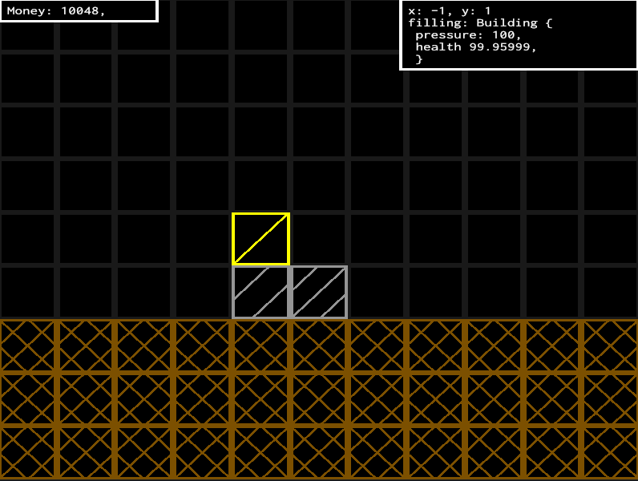

# poliosis
poliosis is a 2D, vector-graphics, city-builder game.

It is written in rust and uses the [wgpu](https://wgpu.rs) graphics library.  
The game aims to present a dystopian world characterised by few morals and a cruel disdain for human life, while delivering a challangeing and, at times, stressful experience to the player.  
All by the medium of minimalistic graphics and fun gameplay.  

It is still in very early stages of developement.

## Usage:
* Make sure you have [Rust](https://www.rust-lang.org/tools/install) installed
* [Clone the repository using git](https://docs.github.com/en/repositories/creating-and-managing-repositories/cloning-a-repository), or download it manually 
* Navigate to the project folder in your terminal of choice
* Run `$ cargo run`
  
Here is an example way to complete the above steps:  
`$ cargo --version`  
`$ git clone https://github.com/nkct/poliosis.git`  
`$ cd ./poliosis`  
`$ cargo run`  

The basic controls are:
* WSAD to move the camera around
* Q and E to zoom in and out
* Enter to open the build menu
* B to open the save menu
* Z to pause

## Contributions:
All contributions, issues, and messages are welcome! If you aren't sure about something or have any questions please reach out to me.
